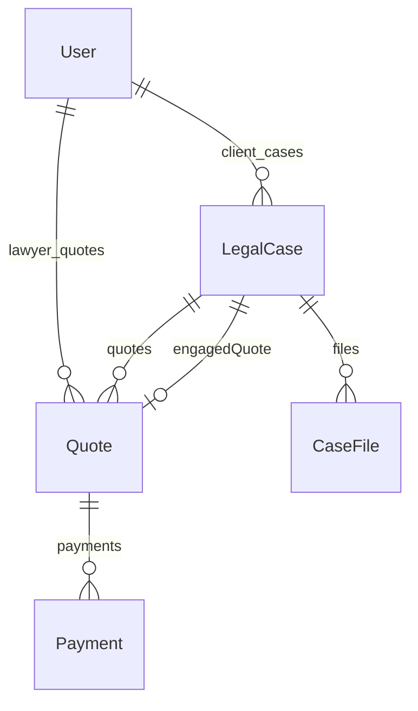

# 🧪 Technical Test — Full-Stack Engineer (Sibyl)

[](https://nodejs.org/)
[](https://nextjs.org/)
[](https://www.prisma.io/)
[](https://tailwindcss.com/)
[](https://supabase.com/)
[](https://stripe.com/)

Build a **mini legal marketplace** with a focus on **correctness, security, and clarity**.

## 🧩 Product Overview

A **two-sided platform**:

- **Clients** post cases with documents.
- **Lawyers** review **anonymized listings** and submit **one quote per case**.
- Clients accept a quote and pay via **Stripe**; the accepted lawyer then gains secure access to the case details and files.

All sensitive operations are handled **server-side**.

## ⚡ Features

- RBAC enforced server-side
- Secure file upload/download with **short-lived signed URLs**
- One active quote per lawyer per case
- Stripe integration in **test mode**
- Server-driven pagination & filters
- Atomic, idempotent quote acceptance

## 🛠 Tech Stack

| Layer     | Technology                                                                                       |
| --------- | ------------------------------------------------------------------------------------------------ |
| Frontend  | Next.js v15.5.2, TailwindCSS, shadcn/ui, Redux, TanStack React Query, TanStack React Table, Nuqs |
| Backend   | Hono, Prisma ORM, Supabase (Auth, PostgreSQL, Storage), Stripe (Payments)                        |
| Dev Tools | Node.js >=20, PNPM/NPM, Prisma Migrate                                                           |

## 🚀 Getting Started (Development)

### 1️⃣ Prerequisites

- Node.js >= 20
- PNPM (preferred) or NPM
- PostgreSQL (Supabase hosted optional)

### 2️⃣ Clone Repository

```bash
git clone https://github.com/andymyp/sibyl-test.git
cd sibyl-test
```

### 3️⃣ Install Dependencies

```bash
pnpm install
# or
npm install
```

### 4️⃣ Environment Variables

```bash
cp .env.example .env
```

Edit `.env` with your:

- `NEXT_PUBLIC_SUPABASE_URL`
- `NEXT_PUBLIC_SUPABASE_PUBLISHABLE_KEY`
- `DATABASE_URL`
- `DIRECT_URL`
- `NEXT_PUBLIC_STRIPE_PUBLISHABLE_KEY`
- `STRIPE_SECRET_KEY`

For detail see on `.env.example`

### 5️⃣ Prisma Setup

```bash
npx prisma migrate dev
npx prisma generate
```

### 6️⃣ Run Dev Server

```bash
pnpm dev
# or
npm run dev
```

Open [http://localhost:3000](http://localhost:3000) in your browser.

## 📦 Example Accounts

| Role   | Email            | Password |
| ------ | ---------------- | -------- |
| Client | client1@mail.com | 123123   |
| Lawyer | lawyer1@mail.com | 123123   |

## 🗄 ERD (Visual)



<details>
<summary>🗄 ERD (Table and Field List)</summary>

```text
User
├─ id (PK)
├─ name
├─ email (unique)
├─ role (CLIENT | LAWYER)
├─ jurisdiction?
├─ barNumber?
└─ createdAt / updatedAt
     │
     │ 1..* (client_cases)
     ▼
LegalCase
├─ id (PK)
├─ clientId (FK → User.id)
├─ title
├─ category
├─ description
├─ status (OPEN | ENGAGED | CLOSED | CANCELLED)
├─ engagedQuoteId? (FK → Quote.id, unique)
├─ createdAt / updatedAt
     │
     ├─ 1..* (files)
     ▼
  CaseFile
   ├─ id (PK)
   ├─ caseId (FK → LegalCase.id)
   ├─ storageKey
   ├─ filename
   ├─ mimeType
   ├─ size
   └─ createdAt

     │
     └─ 1..* (quotes)
     ▼
  Quote
   ├─ id (PK)
   ├─ caseId (FK → LegalCase.id)
   ├─ lawyerId (FK → User.id)
   ├─ amount
   ├─ expectedDays
   ├─ note?
   ├─ status (PROPOSED | ACCEPTED | REJECTED)
   ├─ createdAt / updatedAt
        │
        └─ 0..* (Payment)
        ▼
     Payment
      ├─ id (PK)
      ├─ quoteId (FK → Quote.id)
      ├─ stripeIntentId
      ├─ amount
      ├─ status (PENDING | SUCCEEDED | FAILED)
      └─ createdAt / updatedAt
```

</details>

**Notes:**

- **User (CLIENT)** → `LegalCase` (1-to-many)
- **User (LAWYER)** → `Quote` (1-to-many)
- **LegalCase** → `CaseFile` (1-to-many)
- **LegalCase** → `Quote` (1-to-many)
- **Quote** → `Payment` (0-to-many)
- `LegalCase.engagedQuoteId` points to **single accepted Quote**
- Unique constraint ensures **one quote per lawyer per case**

## 📝 Credits

Developed by **M. Yudistiandy Prabowo**

- [LinkedIn](https://linkedin.com/in/andymyp)
- [GitHub](https://github.com/andymyp)

---

> Built with ❤️ using modern full-stack technologies for a **secure, correct, and clean mini legal marketplace**.
